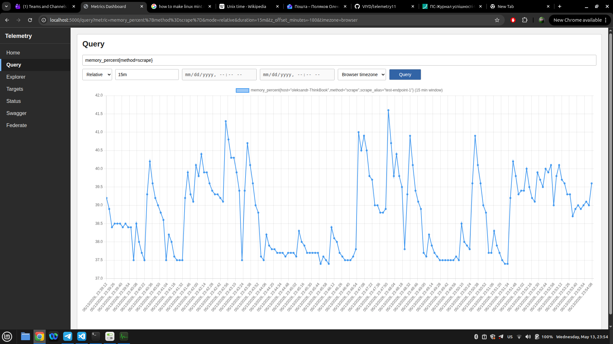
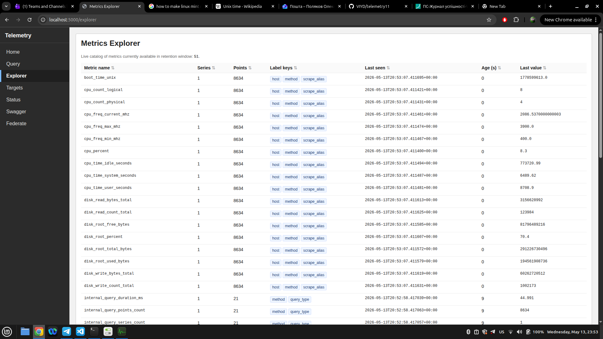
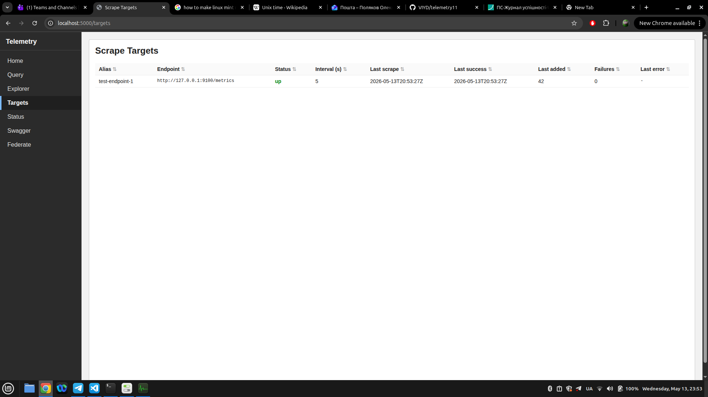

# Telemetry11

Моніторинговий застосунок для приймання, зберігання та перегляду метрик з вбудованим експортером системних метрик.

## Автор

| Поле | Значення |
| --- | --- |
| **ПІБ** | Поляков Олександр Юрійович |
| **Група** | ФЕІ-42с |
| **Спеціальність** | 122 — Комп'ютерні науки |
| **Науковий керівник** | ас. Гусак Олег |
| **Рецензент** | проф. Карбовник Іван |

## Загальна інформація

- Тип проєкту: моніторинговий веб-застосунок (backend + web UI).
- Мова програмування: Python 3.x.
- Фреймворки / бібліотеки: Flask, Gunicorn або Waitress, PyYAML, psutil.
- Конфігурація: YAML-файли + змінні оточення `TELEMETRY_CONFIG`, `EXPORTER_CONFIG`.
- Інтерфейси: HTML UI та JSON API.

## Опис функціоналу

- Прийом метрик через `POST /api/push` та збереження у сховищі.
- Запити часових рядів через `GET /api/metrics` з підтримкою відносного та абсолютного діапазону.
- Веб-інтерфейс для огляду стану, метрик, цілей опитування та каталогу метрик.
- Експортер системних метрик з ендпоїнтом `GET /metrics` та перевіркою `GET /health`.
- Перезавантаження конфігурації без зупинки сервера через `POST /api/reload`.
- OpenAPI JSON та Swagger UI для API.
- Каталог метрик через `GET /api/explorer` та федерований знімок через `GET /federate`.

## Опис основних файлів / структури

| Шлях | Призначення |
| --- | --- |
| [app.py](app.py) | Ініціалізація та запуск основного застосунку. |
| [routes.py](routes.py) | Маршрути веб-інтерфейсу та API. |
| [api_docs.py](api_docs.py) | Формування OpenAPI специфікації. |
| [kernel](kernel) | Ініціалізація налаштувань, застосування дефолтів, перезавантаження конфігурації та запуск фонових циклів (федерування, скрапінг, внутрішні метрики). |
| [metrics](metrics) | Інжест і валідація метрик, зберігання в сховищі, запити часових рядів, каталог/огляд метрик і політики ретенції. |
| [exporter](exporter) | Окремий застосунок-експортер системних метрик. |
| [templates](templates) | HTML-шаблони сторінок інтерфейсу. |
| [examples/configs](examples/configs) | Приклади YAML-конфігурацій. |
| [examples/dockerfiles](examples/dockerfiles) | Docker і docker-compose приклади. |
| [requirements.txt](requirements.txt) | Python-залежності. |
| [gunicorn.conf.py](gunicorn.conf.py) | Конфігурація Gunicorn для основного застосунку. |
| [exporter/gunicorn.conf.py](exporter/gunicorn.conf.py) | Конфігурація Gunicorn для експортера. |
| [Dockerfile](Dockerfile) | Образ для запуску основного застосунку. |
| [Makefile](Makefile) | Команди для локальних задач. |
| [scripts/push.sh](scripts/push.sh) | Приклад скрипта для push-запиту метрик. |

## Як запустити проєкт "з нуля"

### 1. Встановлення інструментів

- Python 3.x.
- Docker (опційно, якщо запускаєте в контейнері).

### 2. Отримання коду

Якщо репозиторій уже є локально, пропустіть цей крок.

```
git clone https://github.com/VIYD/telemetry11.git
cd telemetry11
```

### 3. Створення віртуального середовища

Linux/macOS:

```
python3 -m venv .venv
source .venv/bin/activate
```

Windows:

```
C:\Python\python.exe -m venv .venv
\.venv\Scripts\Activate.ps1
```

### 4. Встановлення залежностей

```
pip install -r requirements.txt
```

### 5. Встановлення Waitress (лише для Windows)

```powershell
pip install waitress
```

### 6. Конфігурація

Підготуйте YAML-конфігурації та вкажіть їх у змінних оточення.

Приклади конфігурацій: [examples/configs/telemetry.yaml](examples/configs/telemetry.yaml), [examples/configs/telemetry_federate.yaml](examples/configs/telemetry_federate.yaml), [examples/configs/exporter.yaml](examples/configs/exporter.yaml).

### 7. Запуск основного застосунку

Linux/macOS (Gunicorn):

```
TELEMETRY_CONFIG=/path/to/telemetry.yaml \
gunicorn -c gunicorn.conf.py app:app
```

Windows (Waitress):

```powershell
$env:TELEMETRY_CONFIG="D:\dev\telemetry11\examples\configs\telemetry.yaml"
C:\Python\python.exe -m waitress --listen=0.0.0.0:5000 app:app
```

### 8. Запуск експортера

Linux/macOS:

```
EXPORTER_CONFIG=/path/to/exporter.yaml \
gunicorn -c exporter/gunicorn.conf.py exporter.exporter:app
```

Windows:

```powershell
$env:EXPORTER_CONFIG="D:\dev\telemetry11\examples\configs\exporter.yaml"
C:\Python\python.exe -m waitress --listen=0.0.0.0:9100 exporter.exporter:app
```

### 9. Docker (опційно)

```
docker build -t telemetry11 .

docker run --rm -p 5000:5000 \
-e TELEMETRY_CONFIG=/config/telemetry.yaml \
-v /examples/configs/telemetry.yaml:/config/telemetry.yaml:ro \
telemetry11
```

## API приклади

### POST /api/push

```json
{
	"name": "cpu_percent",
	"value": 10.0,
	"labels": {
		"source": "test"
	}
}
```

Відповідь:

```json
{
	"status": "ok",
	"added": {
		"name": "cpu_percent",
		"labels": {
			"source": "test",
			"method": "push"
		},
		"timestamp": "2026-04-19T16:00:00+00:00",
		"value": 10.0
	}
}
```

### GET /api/metrics

Приклад запиту:

```
GET /api/metrics?metric=cpu_percent&minutes=15
```

Відповідь:

```json
{
	"metric": "cpu_percent",
	"series": [
		{
			"name": "cpu_percent",
			"labels": {
				"host": "node-1"
			},
			"points": [
				{
					"timestamp": "2026-04-19T16:00:00+00:00",
					"value": 12.5
				}
			]
		}
	],
	"start": "2026-04-19T15:45:00+00:00",
	"end": "2026-04-19T16:00:00+00:00",
	"window_minutes": 15
}
```

## Інструкція для користувача

1. Відкрийте `http://localhost:5000/` і переконайтесь, що інтерфейс доступний.
2. Для перегляду метрик використовуйте сторінки `GET /query`, `GET /explorer`, `GET /status`.
3. Для отримання каталогу метрик скористайтесь `GET /api/explorer`.
4. Для інтеграції з іншими системами використовуйте `GET /api/metrics`.
5. Для відправки метрик по push виконайте `POST /api/push`.
6. Для перевірки експортера відкрийте `http://localhost:9100/metrics` або `http://localhost:9100/health`.
7. Для перезавантаження конфігурації використовуйте `POST /api/reload`.
8. Документація API доступна на `GET /openapi.json` і `GET /swagger`.

## Приклади / скріншоти





## Проблеми і їх вирішення

| Проблема | Рішення |
| --- | --- |
| `ModuleNotFoundError` або `ImportError` | Перевірити, що виконали `pip install -r requirements.txt` у активному віртуальному середовищі. |
| Повідомлення про заборону прямого запуску | Запускати застосунок через Gunicorn або Waitress. |
| `TELEMETRY_CONFIG` або `EXPORTER_CONFIG` не вказані | Встановити змінні оточення перед запуском. |
| Конфігурація YAML не читається | Переконатися, що файл існує і має валідний синтаксис. |
| Address already in use | Змінити порт у команді запуску або звільнити порт. |